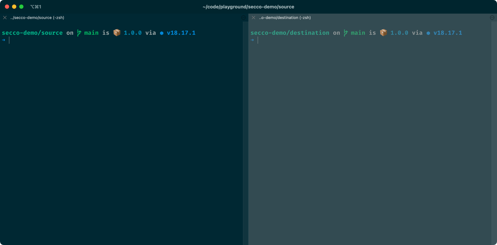

import { Tabs, TabItem } from '@astrojs/starlight/components';
import { Steps } from '@astrojs/starlight/components';

Welcome to the secco tutorial! We're excited you're here.

The goal of this tutorial is to help you create a mental model for how secco works by trying it out in a demo project. Along the way, you'll learn how to install secco, use its functionalities, and more!

:::note[Intended audience]

You should be familiar with using git, the terminal, and npm packages. You should also know how build tooling works conceptionally. As the target audience for secco are package authors wanting to test their changes, this tutorial assumes some pre-existing knowledge. 

:::

## Prerequisites

Before you can start the tutorial, follow these required steps:

- Install [Node.js](https://nodejs.dev) 20.19.0 or later
- Read the [terminology guide][terminology]
- [Clone](https://docs.github.com/en/repositories/creating-and-managing-repositories/cloning-a-repository) the [secco-demo][demo] repository

Snippets for quicker cloning:

<Tabs>
  <TabItem label="SSH">
  
  ```shell
  git clone git@github.com:lekoarts-demos/secco-demo.git
  ```
  
  </TabItem>
  <TabItem label="HTTPS">
  
  ```shell
  git clone https://github.com/lekoarts-demos/secco-demo.git
  ```
  
  </TabItem>
</Tabs>

Afterwards, navigate to the newly created `secco-demo` folder:

```shell
cd secco-demo
```

## Install secco

As the first step, open your terminal and install secco globally:

```shell
npm install --global secco
```

Ensure that the installation was successful by running `secco --help`. You should see an output similar to this:

```shell
➜ secco --help
Usage: secco <command>

Commands:
  secco                             Scan destination and copy files from source  [default]
  secco packages [packageNames...]  Specify list of packages you want to link
  secco init                        Initialize a new .seccorc file
```

## How to use secco

In this part of the tutorial you'll learn secco's recommended workflow. This way you'll get the most out of its functionalities and can apply it to your own projects later.

Inside the `secco-demo` project two folders exist:

- `source`
- `destination`

This mirrors the use case that secco solves: You want to apply your unreleased, in-flight changes from your package(s) to a test project. secco can work on a single package or a monorepo of packages.

Time to start using secco! In these next couple of steps you'll start the watch mode of your source compilation, initialize secco's configuration file, and copy over any changes to your destination.

:::tip[Terminal setup]

Open both `source` and `destination` inside your terminal. You can create separate panes for them, use two tabs, or put them into separate windows. Whatever you prefer. Here's how a split pane layout would look like:



On the left side you have `secco-demo/source`, on the right side `secco-demo/destination`.

:::

### Start watch mode

When authoring a npm package you most often have to compile your source code to different formats. Either to support older formats like CommonJS or because you write your code in TypeScript. Either way, if you want to continuously copy over your changes to an example project, you need to run your bundler in watch mode. This tutorial uses [tsup](https://tsup.egoist.dev/) but your bundler will also have such an option.

<Steps>

1. Inside `secco-demo/source` install the required dependencies:

    ```shell frame="terminal" title="secco-demo/source"
    npm install
    ```

1. Start the watch mode by running the `watch` script:

    ```shell frame="terminal" title="secco-demo/source"
    npm run watch
    ```

    You should see a similar output to this:

    ```shell frame="terminal" title="secco-demo/source"
    ➜ npm run watch

    CLI Building entry: src/index.ts
    CLI tsup v7.2.0
    CLI Using tsup config: /Users/name/secco-demo/source/package.json
    CLI Running in watch mode
    CLI Target: node16
    CLI Cleaning output folder
    ESM Build start
    ESM dist/index.mjs     138.00 B
    ESM dist/index.mjs.map 223.00 B
    ESM ⚡️ Build success in 34ms
    CLI Watching for changes in "."
    CLI Ignoring changes in "**/{.git,node_modules}/**" | "dist"
    ```

</Steps>

For the rest of this tutorial keep this script running. In your own projects you should do the same. Once you edit the file `secco-demo/source/src/index.ts` tsup will recompile it and output it into the `dist` folder.

:::note[No watch mode needed?]

If you're authoring your code in a way that a compilation step is unnecessary (e.g. pure ESM) then please ignore this part of the tutorial for your own project. secco will still pick up those changes in your source files if they are defined as entrypoints in your `package.json`.

:::

### Initialize a `.seccorc` file

Before running secco inside `secco-demo/destination` it needs to know where to look for the source files. You can provide that information by creating a `.seccorc` configuration file. On all consecutive runs of secco it'll reuse that information.

You don't have to create that file on your own as secco provides its own command for it.

<Steps>

1. Inside `secco-demo/destination`, run the following command in your terminal:

    ```shell frame="terminal" title="secco-demo/destination"
    secco init
    ```

1. When the prompt asks, **"What is the absolute path to your source?"**, enter the absolute path to your source.

    ```shell frame="terminal" title="secco-demo/destination"
    ? What is the absolute path to your source?
    ✔ · /Users/name/secco-demo/source
    ```

1. The prompt will show you a summary of what `secco init` will do. When the prompt asks, **"Do you want to create the file?"**, enter **"Y"**.

</Steps>

You should have a new `.seccorc` file inside your `secco-demo/destination` folder.

:::caution

secco **requires** to either find a `.seccorc` file (with [`source.path`](/reference/config/#sourcepath) set) or that the [`SECCO_SOURCE_PATH`](/reference/config/#secco_source_path) environment variable is defined in the destination.

:::

### Start secco

Time to finally start secco! 🚀 Inside `secco-demo/destination` run `secco`:

```shell frame="terminal" title="secco-demo/destination"
secco
```

You should see an output similar to this:

```shell frame="terminal" title="secco-demo/destination"
➜ secco

 WARN  say-hello-world-secco does not seem to be installed and is also not published on npm. Error: No response or Non-200 response from https://unpkg.com/say-hello-world-secco@^1.0.0/package.json

[Verdaccio] Starting server...
[Verdaccio] Started successfully!
Publishing say-hello-world-secco@1.0.0-secco-1702634686296 to local registry...
(node:18034) [DEP0106] DeprecationWarning: crypto.createDecipher is deprecated.
(Use `node --trace-deprecation ...` to show where the warning was created)
Published say-hello-world-secco@1.0.0-secco-1702634686296 to local registry
Installing packages from local registry:
 - say-hello-world-secco
✔ Installation finished successfully!
Copied package.json to node_modules/say-hello-world-secco/package.json
Copied dist/index.mjs.map to node_modules/say-hello-world-secco/dist/index.mjs.map
Copied dist/index.mjs to node_modules/say-hello-world-secco/dist/index.mjs
```

A couple of things happened now, here's the breakdown:

- The first line warns that `say-hello-world-secco` isn't installed and not published on npm. This is correct since you didn't run `npm install` inside `secco-demo/destination` as it would't have worked. After all, `say-hello-world-secco` isn't published yet. Therefore secco published the package to a local [Verdaccio][verdaccio] registry.

    You won't see this warning if your package is already published to npm and you're trying out a new version locally. In this instance you probably already installed the current latest version.

- Once published to Verdaccio, `npm install` is run inside `secco-demo/destination` using the local registry.

- All package files are copied over

- The `package.json` inside `secco-demo/destination` was changed to something like this:

    ```json title="secco-demo/destination/package.json"
    {
      "dependencies": {
        "say-hello-world-secco": "1.0.0-secco-1702634686296"
      },
    }
    ```

    This shows you that indeed secco installed the version from the local registry.

- **Tip:** If you stop secco and start it again you'll see that only files will be copied over. The reason is that the whole Verdaccio step is skipped if it's not necessary, making the process faster!

Done! Keep the script running as long as necessary and enjoy the ease of use in the next step of this tutorial.

:::tip[Skip unnecessary work]

Let's say `secco-demo/source` would be a monorepo of multiple packages and `secco-demo/destination` would use a couple of them. However, they are completely separate and you're only working on one of them ⸺ then you can use the [`secco packages`][secco-packages] command instead of running `secco`.

For example:

```shell
secco packages say-hello-world-secco
```

:::

### Edit your source

You reached the last part of the tutorial, great! Now that everything is set up, it's time to see secco in action. You'll be changing the source files and notice the before and after differences. The applied changes from source to destination will be near instantaneous.

<Steps>

1. Inside `secco-demo/destination` run the `start` script:

    ```shell frame="terminal" title="secco-demo/destination"
    npm run start
    ```

    You should see this output:

    ```shell frame="terminal" title="secco-demo/destination"
    ➜ npm run start

    > destination@1.0.0 start
    > node cli.mjs

    Hello World!
    ```

1. Open `secco-demo/source/src/index.ts` and edit the file:

    ```diff lang="ts"
    function sayHelloWorld() {
    - console.log('Hello World!')
    + console.log('Hello secco!')
    }

    export { sayHelloWorld }
    ```

1. Inside `secco-demo/destination` rerun the `start` script:

    ```shell frame="terminal" title="secco-demo/destination"
    ➜ npm run start

    > destination@1.0.0 start
    > node cli.mjs

    Hello secco!
    ```

    Great, it worked! 🎉

</Steps>

From now on every time you make a change to your source file it'll be reflected inside your test project. Depending on your setup this will also work with hot reloading (so no restart of script/server necessary).

## What's next?

Browse the CLI reference: [commands](/reference/commands/), [config options](/reference/config/), and [flags](/reference/flags/). You can also check out the advanced guides like [Continuous Integration](/guide/continuous-integration/).

:::tip[Share your feedback!]

The goal for this tutorial is to be helpful and easy to follow. We'd love to hear your feedback about what you liked and didn't like.

Use the [Tutorial Feedback][tutorial-feedback] GitHub discussions board to voice your opinion. Thanks!

:::

[demo]: https://github.com/lekoarts-demos/secco-demo
[terminology]: /guide/terminology/
[verdaccio]: https://verdaccio.org
[secco-packages]: /reference/commands/#secco-packages
[tutorial-feedback]: https://github.com/LekoArts/secco/discussions/categories/tutorial-feedback
